# ECG❤️📈
本プロジェクトはKaggleの「PhysioNet - Digitization of ECG Images」のデータを用い、写真で撮影された心電図をデジタルデータにするツールです。  

# プロジェクト概要📝
近年、AIの発展で医療分野にも大きな変化が起きています。病気の要因となる細胞を画像処理を用いて発見するなど、AIの医療分野への貢献は様々です。これらはすべて大量の学習データがあってこその恩恵です。  
心電図は患者の様態を反映する指標として頻繁に用いられます。心電図を読み解くことで、患者の異変を察知できる事は多々あります。これをAI、機械学習を用いて自動化する事でより多くの患者が救われると思いませんか？そのためには心電図のデータが大量に必要となります。  
しかし、従来の心電図のデータは画像として保存されており、デジタルデータとして機能しません。  
そこで、画像から心電図を抽出し、データをデジタル化しましょう。心電図の画像からデジタルデータを正確に抽出することができれば、現存する心電図画像を用いて多くの患者を救うことが可能かもしれません。  

# Kaggle上のルール📜
「PhysioNet - Digitization of ECG Images」のルールにより、データセットの再配布は禁止となっています。    
クレジットは以下です。    

コンペティション：PhysioNet - Digitization of ECG Images(https://www.kaggle.com/competitions/physionet-ecg-image-digitization)  
データセット：Extract the ECG time-series data from scans and photographs of paper printouts of the ECGs.(https://www.kaggle.com/competitions/physionet-ecg-image-digitization/data)  
スポンサー：Emory University  
スポンサーアドレス：101 Woodruff Circle Atlanta, GA 30322  
ライセンス：CC BY 4.0(https://creativecommons.org/licenses/by/4.0/deed.en)  

# データセット📂
### 以下はKaggle上で公開されているデータの解説です。  
ダウンロードURL:https://www.kaggle.com/competitions/physionet-ecg-image-digitization/data  

＊train.csv：  
　・id  
　・fs：サンプリング周波数  
　・sig_len：ECG測定シーケンス全体の長さ。今回は常に10秒×fsです。 

＊train/[id]/[id].csv：12誘導心電図の生時系列データを含むcsvファイル。  
　列はI、II、III、aVR、aVL、aVF、V1、V2、V3、V4、V5、V6です。  
＊train/[id]/[id]-0001.png：ECG-image-kitによって生成されたオリジナルカラー心電図画像。  
＊train/[id]/[id]-0003.png：カラー印刷された画像、カラーでスキャンされた画像。  
＊train/[id]/[id]-0004.png：カラーで印刷された画像を白黒スキャンした。  
＊train/[id]/[id]-0005.png：カラー印刷されたがそうを携帯電話で撮影した写真。  
＊train/[id]/[id]-0006.png：ノートパソコンの画像に表示された心電図を携帯電話で撮影した写真。  
＊train/[id]/[id]-0009.png：染みや水にぬれた印刷済み心電図を形態電話で撮影した写真。  
＊train/[id]/[id]-0010.png：損傷が著しい印刷された心電図を形態電話で撮影した写真。  
＊train/[id]/[id]-0011.png：カラーで型抜きされた印刷済み心電図画像のスキャン画像。  
＊train/[id]/[id]-0012.png：カビが生えた印刷済み心電図画像の白黒スキャン画像。

＊test.csv：  
　・id  
　・lead：12個の標準ECG誘導のうちの1つ：I、II、III、aVR、aVL、aVF、V1、V2、V3、V4、V5、V6。  
　・fs：サンプリング周波数  
　・number_of_rows：各リードについて予測するデータポイントの数。  

＊test/[id].png：test.csvファイル内の各IDにつき1枚の画像が含まれています。  

＊sample_submission.parquet：正しい提出形式を示したファイル。  
　・id：形式は{base_id}_{row_id}_{lead}（例：262_12_V4）です。  
　・base_id：test.csvからのid  
　・lead：12種類の標準的な心電図誘導のうちの1つ：I、II、III、aVR、aVL、aVF、V1、V2、V3、V4、V5、V6。  
　・row_id：インデックス。  
　・value：測定値。単位はmV。 

# 結果・評価📊
本来、「PhysioNet - Digitization of ECG Images」コンペティションでは評価指標としてSNRが適用されます。<br>
これは、ECG画像から再構成された時系列ECGの品質を真のECG時系列と比較評価するために設計されています。<br>
詳しくは本コンペティションページを参照してください。<br>

本プロジェクトではmIoUを用いて、モデルの最適化、評価を行いました。<br>
未知データに対する最終的なIoUは約0.74でした。<br>

以下に予測結果と、最終的に出力されたグラフの一例を示します。<br>
また、以下で使用されている画像はKaggle上のデータではありません。<br>
ノイズも本来のデータとは様相が違うため、若干モデルの精度が落ちています。<br>
<p align="left">
  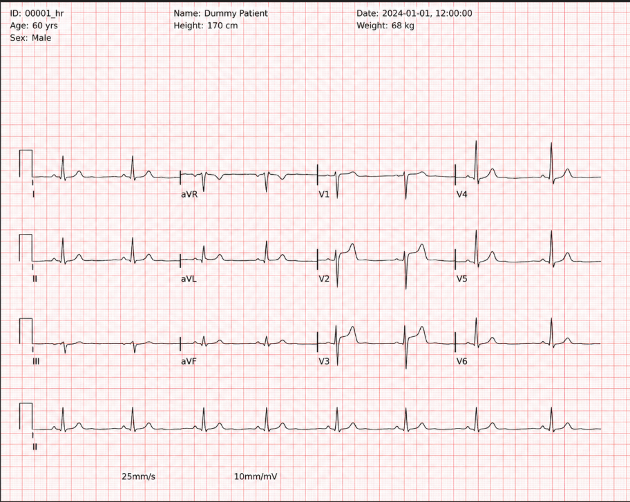
</p>
↑写真A<br>
写真Aのような綺麗な画像から波形を抽出するのは比較的簡単です。<br>
しかし、実際のデータには影や紙のシワ、汚れ、撮影角度、PC画面の撮影など様々なノイズが含まれます。<br>
以下の画像がノイズが加わった画像です。<br>
<p align="left">
  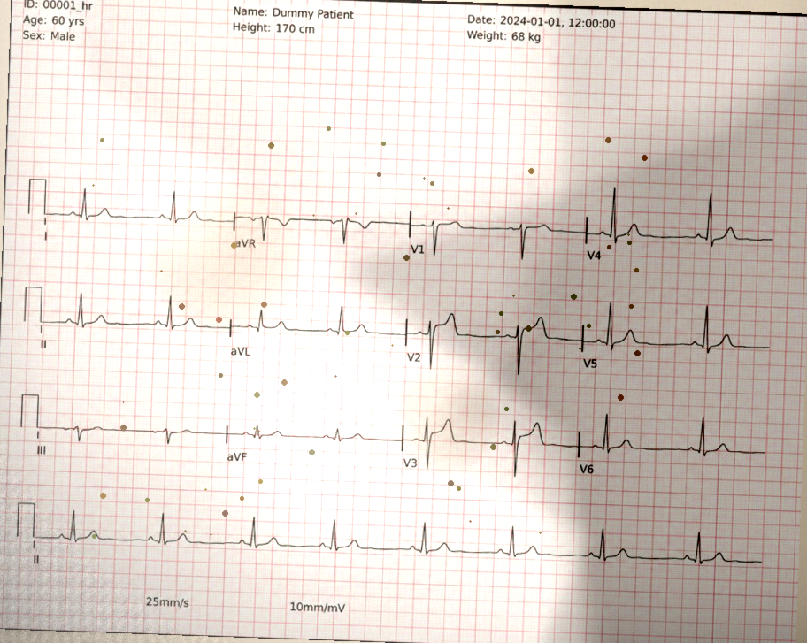
</p>
↑写真B  
<p align="left">
  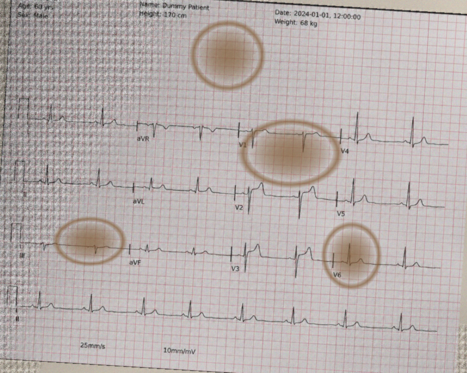
</p>
↑写真C    
<p align="left">
  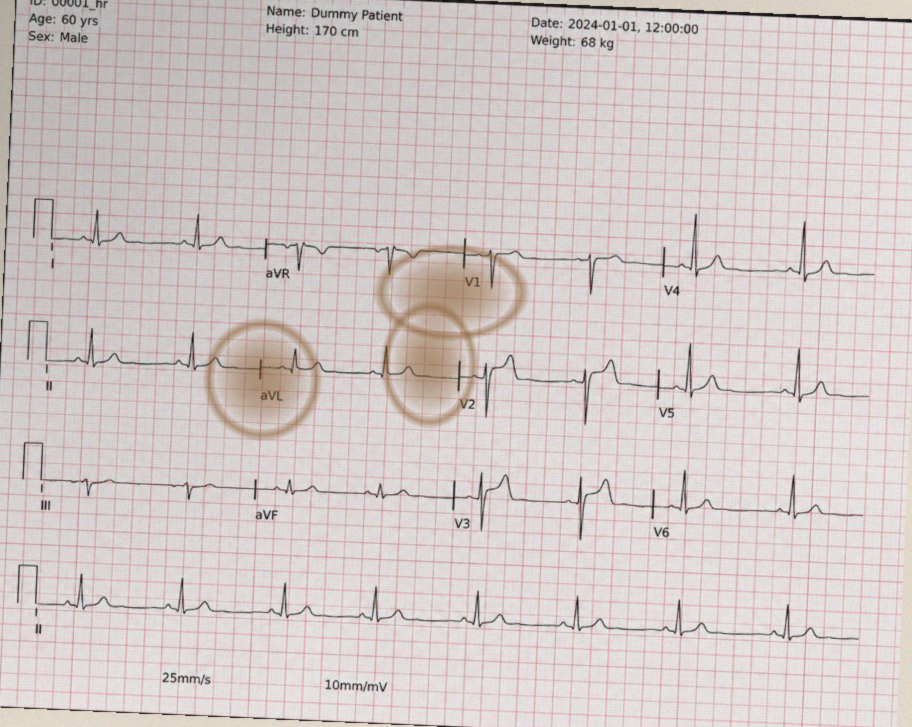
</p>
↑写真D <br>
写真Aから、深層学習を用いて波形だけを抽出した結果が以下の写真です。<br>
<p align="left">
  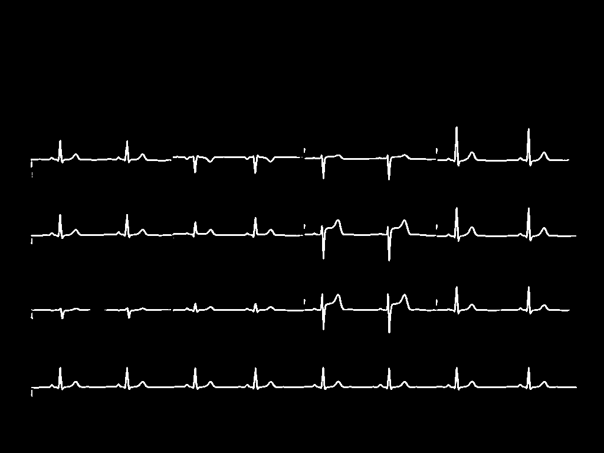
</p>
上記の写真のうち、デジタル化したい波形を囲います。<br>
囲う作業の様子は以下の写真です。  
<p align="left">
  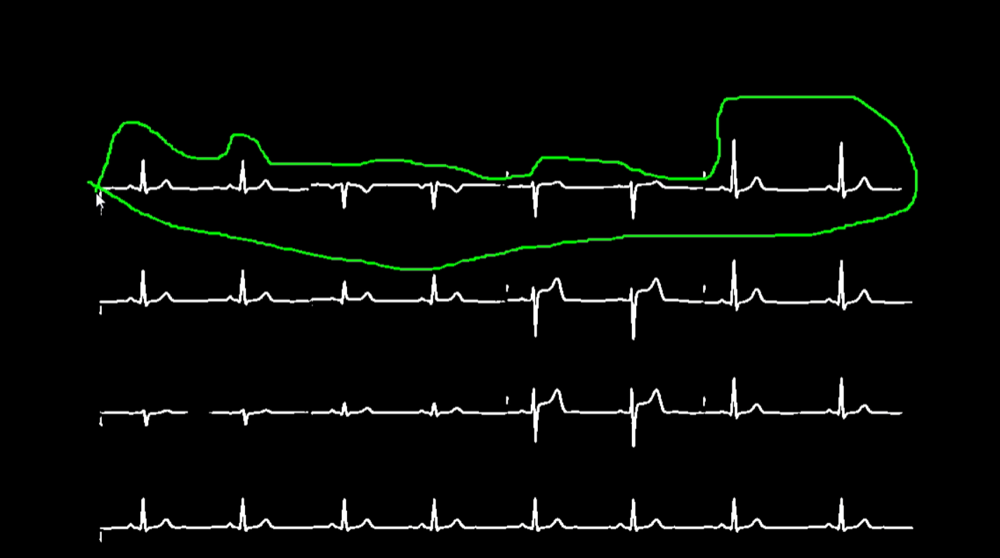
</p>
その結果、以下のようなデジタル化されたデータを取得する事ができます。<br>
<p align="left">
  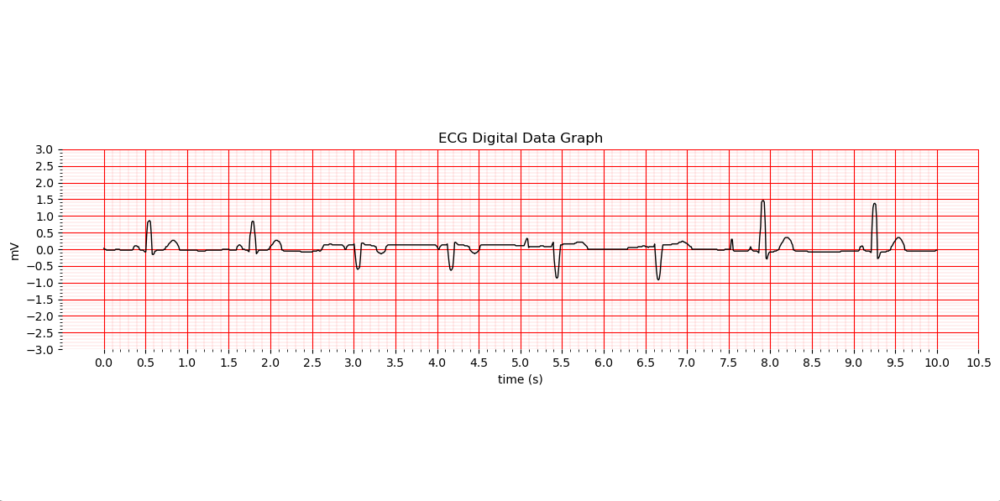
</p>
しかし、写真B～Dのようなノイズを含んだ画像から波形を抽出するのは困難です。<br>
後処理(デジタル化)の段階で波形を補完し、理想通りの波形を抽出可能な場合もあれば、そうでない場合もあります。<br>
以下は写真B～Dの予測マスク画像と、一番上の波形を囲ったときにグラフです。<br>
<p align="left">
  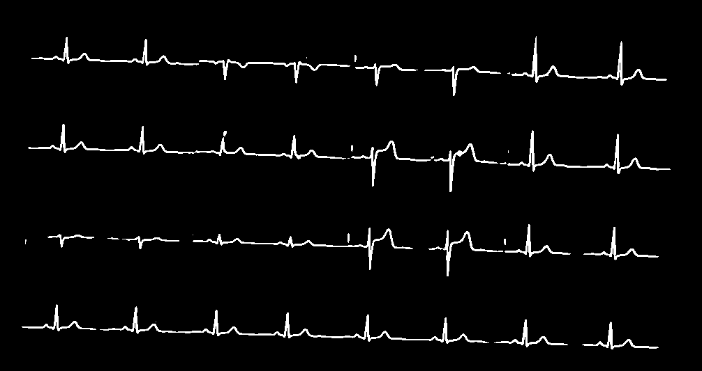
</p>
<p align="left">
  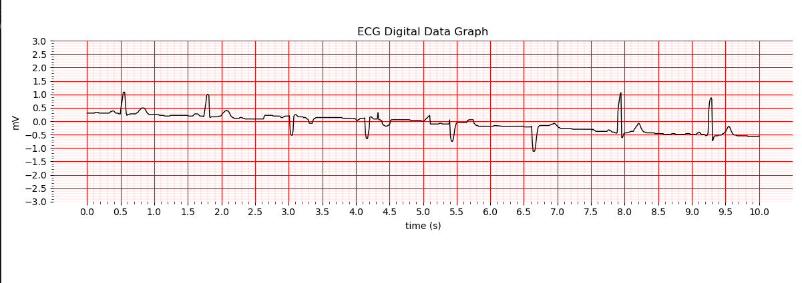
</p>
↑写真Bの予測マスク画像とグラフ  
<p align="left">
  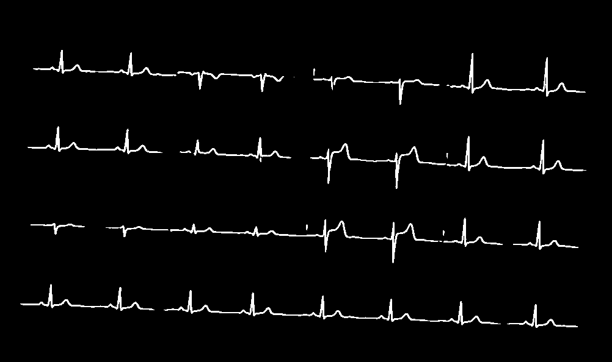
</p>
<p align="left">
  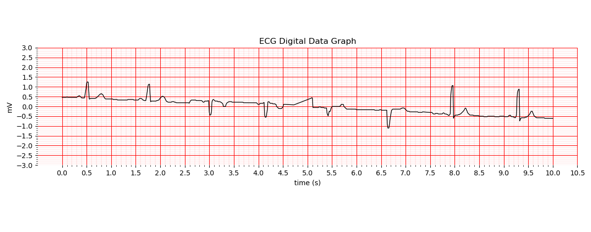
</p>
↑写真Cの予測マスク画像とグラフ  
<p align="left">
  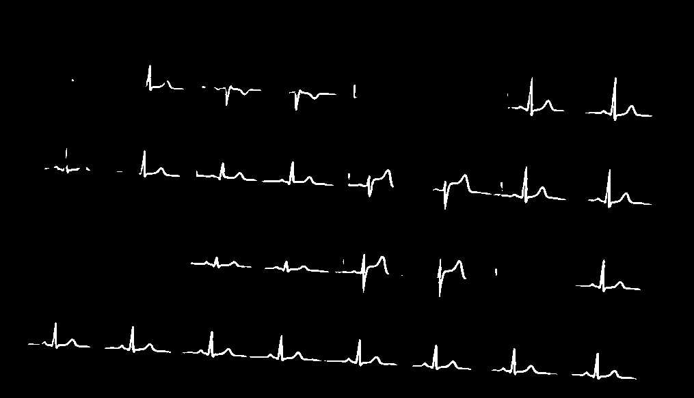
</p>
<p align="left">
  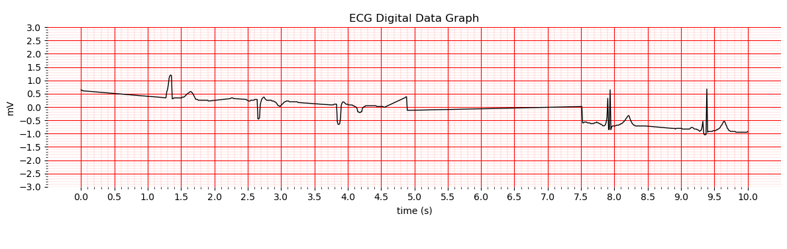
</p>
↑写真Dの予測マスク画像とグラフ<br>
上記の写真からわかる通り、波形の抽出が許容範囲内の精度であれば後処理により理想的な波形グラフの作製が可能です。<br>
一方、画像Eの結果を見てわかる通り、ノイズが重度で許容範囲外の精度の時は後処理後に理想とは程遠いグラフが出力されます。<br>

# デモ🎥
データセットの公開が禁止されているため、私の作製したアノテーションデータがお届けできません。<br>
お手元の環境で実行するのは厳しいかと思います。<br>
ですが一応、デモンストレーションを以下に記載します。<br>

まず、Kaggle上からデータセットをダウンロードしてください。https://www.kaggle.com/competitions/physionet-ecg-image-digitization/data <br>
その後、label_studioを用いてアノテーションをお願いします。<br>
この作業は1枚の画像に対して約40分要するので、非常に大変だと思います、、、。<br>
カレントディレクトリ内にdataフォルダを作成し、その中にtrainフォルダを作成します。<br>
trainフォルダの中にimageフォルダとmaskフォルダを作成します。<br>
imageフォルダ内には後処理後の学習画像を、maskフォルダ内にはアノテーション画像を保存してください。<br>
画像のファイル名は両フォルダ内ともにtask{n}.pngとし、nには1から順番に任意の数字を入れてください。<br>

main.pyの実行にはGUI表示を必須とする処理が含まれています。<br>
これはDockerコンテナ上での実行と非常に相性が悪いため、main.pyを実行する際は仮想環境上でお願いします。<br>
train.py、available_gpu.pyのみを実行したい場合はDockerコンテナ上で行えます！！<br>
以下に2通りの実行方法を記載します。<br>
### ・仮想環境上で実行(推奨)
まず以下のコマンドを用いて仮想環境を構築します。<br>
```bash
conda create -n env_name python=3.11
```
次に仮想環境を有効化します。<br>
```bash
conda activate env_name
```
次にGPUを使用可能にするために以下のコマンドを実行<br>
```bash
conda install pytorch torchvision torchaudio pytorch-cuda=12.1 -c pytorch -c nvidia
```
次にrequirements.txt内のライブラリをインストール<br>
```bash
pip install -r requirements.txt
```
これで環境構築は完了です。<br>
available_gpu.pyの実行は以下<br>
```bash
python available_gpu.py
```
train.pyの実行は以下<br>
```bash
python train.py
```
main.pyの実行は以下。<br>
```bash
python main.py
```
学習済みモデルはPull時に存在するため、train.pyを行わずにmain.pyを実行可能です。<br>
main.pyの実行後は波形を抽出したい画像が入ったフォルダを選択してください。<br>

### ・Dockerコンテナ上で実行
ビルドを以下のコマンドで実行。時間がかかる場合があります。<br>
```bash
docker build -t your_project_name .
```
コンテナの起動を以下で実行。gpuの利用とコンテナ内でのインタラクティブなやり取りを前提として、メインプロセス終了後、コンテナは削除されます。<br>
また、コマンド実行時点でコンテナ内に入ります。<br>
```bash
docker run --gpus all -it your_project_name
```
これでDocker環境の構築は終了です。<br>
available_gpu.pyの実行は以下<br>
```bash
python available_gpu.py
```
train.pyの実行は以下<br>
```bash
python train.py
```
先ほど述べた通り、main.pyをコンテナ上で実行してもエラーが発生します。<br>
コンテナから出たいときは以下のコマンドを実行。自動でコンテナは削除されます。<br>
```bash
exit
```


# アーキテクチャ図🏗️
### [ECG画像]
### ↓  
### [前処理]  
- QRコードを見つけ、それを基に図を正常な位置まで回転  
- 背景の赤い升目を除去  
- グレースケール化  
- 細くて長い黒い縦線（グリッド）を除去  
- リサイズ（1024×768）  

### ↓  
### [アノテーション]  
- Label Studioを用いたアノテーション  

### ↓  
### [学習（U-Net）]  
- セグメンテーションをU-Netで実施  

### ↓    
### [推論]  
-  testデータの前処理
-  testデータをモデルに適用

### ↓  
### [後処理]  
- 波形領域の切り取り  

### ↓  
### [デジタル化]  
- ピクセル → 時系列変換  
- 各x列ごとにyを1点決定  
- 線として補間  
- ブロック分割・連続性で誤検出回避  
- CSVとして保存  

### ↓  
### [可視化]  
- CSVからグラフ化

# 環境・使用技術🛠️
### 言語・環境
- Python
- Windows 11
- CUDA（GPU環境）

### 深層学習
- PyTorch 2.5.1（cu121 / CUDA 12.1）
- TorchVision
- Torchaudio
- U-Net（セグメンテーションモデル）

### 画像処理
- OpenCV 4.13.0
- NumPy 2.4.4
- SciPy 1.17.1
- Pillow

### データ処理
- Pandas
- NumPy

### 可視化
- Matplotlib 3.9.1

### アノテーション
- Label Studio

### その他ライブラリ
- NetworkX
- SymPy
- Requests
- PyYAML

### GPU環境
- NVIDIA RTX 2000 Ada Generation

# 学習の構造🧠
[ECG Dataset]<br>
↓<br>
[Dataset Loading]<br>
image / mask 読み込み<br>
SegDataset構築<br>
↓<br>
[Train / Validation Split]<br>
90% train / 10% val<br>
↓<br>
[DataLoader]<br>
batch_size指定<br>
shuffle (trainのみ)<br>
↓<br>
[Model Initialization]<br>
U-Net<br>
↓<br>
[Optimizer]<br>
AdamW (lr = 1e-3)<br>
↓<br>
[Training Loop]<br>
forward / loss計算<br>
AMP（mixed precision）<br>
gradient accumulation<br>
↓<br>
[Validation]<br>
mIoU評価<br>
↓<br>
[Logging]<br>
loss / mIoU 出力<br>
↓<br>
[Inference on Validation]<br>
↓<br>
[Save Results]<br>
予測画像保存<br>
↓<br>
[Model Saving]<br>
trained_model.pth<br>

# コード解説💻
## **main.py**：画像の入ったファイルを選択し、それらの画像から波形を抽出してデジタルデータを入手するための実行コード
```bash
python main.py
```
上記コマンドで実行可能。
GPU環境はmain.pyの実行に必要ありません。  

## **train.py**：前処理後の画像とアノテーション画像を用いてモデルを学習し、モデルを保存するためのコード
```bash
python train.py
```
上記のコマンドで実行可能。  
GPU環境がない場合はtrain.pyは実行できません。  

## **src/available_gpu.py**：GPU実行環境があるか否かを確認するためのコード
```bash
python available.py
```
上記のコマンドで実行可能。  
「CUDA available：True」が表示された場合、GPU環境は整っています。  

## **src/circle.py**：画像上でユーザーが手書きで囲った領域を抽出する関数
  -  ### freehand_crop
手書きで囲まれた領域以外を黒にすることで波形を抽出する  

## **src/dataset.py**：ECG画像データとマスクを読み込んで、学習用・テスト用に渡すデータセットクラス
  -  ### SegDataset
  後処理後画像とマスク画像をセットで読み込むデータセット  
  overfit_oneは1枚の画像だけで繰り返し学習するためのモード  
  -  ### TestImageDataset
  テスト画像だけを読み込むデータセット  
## **src/drawing_graph.py**：セグメンテーション結果から１次元ECG波形を復元し、CSV化、可視化するためのコード  
  -  ### extract_1d_signal_from_clean_mask
  マスク画像からECG波形を１次元信号に変換する
  -  ### df2csv
  DataFrameをCSVとして保存する関数
  -  ### create_graph
  CSVを読み込み、ECG波形を復元し、実際の心電図グラフとして描画する  

## **src/model.py**：U-Netモデルの構造を定義するための関数
  -  ### DoubleConv
  特徴抽出を行う基本ブロック
  -  ### Down
  特徴を圧縮して抽象化するエンコーダ層
  -  ### Up
  特徴を復元しつつ結合するデコーダ層
  -  ### UNet
  エンコードとでコードを統合したセグメンテーションモデル
## **src/predict.py**
  -  ### predict
  学習済みU-Netモデルで画像をセグメンテーションし、予測マスクを保存する関数
## **src/preprocess.py**：画像の前処理をするためのコード
  -  ### delete_red
  赤いグリッドを除去する関数
  -  ### change_gray
  グレースケール化するための関数
  -  ### find_QR
  QRの位置から画像の向きを補正するための関数
  -  ### sizing
  画像のサイズを(1024, 768)にリサイズするための関数
  -  ### remove_black_vertical_lines
  細長く、黒い縦線を除去するための関数
  -  ### preprocess_test_image
  入力画像に対して前処理をまとめて適用する統合関数
## **src/utils.py** ：セグメンテーションの学習・評価・可視化を行う処理群
  -  ### dice_loss_multi_class
  領域の重なりを評価するDice損失
  -  ### focal_loss_multi_class
  難しいサンプルに重点を置く損失関数
  -  ### compute_miou
  クラスごとのIoUを平均した評価指標(今回は1クラスなので、平均の効果はない。)
  -  ### evaluate
  モデルの性能を検証データで評価する
  -  ### save_predictions
  入力・予測・正解マスクを画像として保存する
  -  ### set_seed
  乱数を固定して再現性を確保する
  -  ### train_one_epoch
  １エポック分の学習を実行する

# 工夫点💡
### データ特性の分析と前処理設計
  -  機械学習に入る前に、まず画像そのものの特徴を分析しました。その結果、  
  画像サイズと画像ナンバーに依存関係があることを発見しました。  
  これに基づき、画像ナンバーや状態に応じて前処理を分岐させ、どの形式の画像でも波形情報を保持できるように設計しました。  

### QRコードを用いた自動回転補正
  -  ECG画像の中に上下反転や回転されたデータが存在することを確認しました。  
  そこで、QRコードの位置情報を利用し、画像の向きを自動補正する処理を追加しました。  

### タスク設計の見直し
  -  当初は4種類の波形を同時に分類・検出するマルチクラスセグメンテーションとして設計していたが、難易度が高く、不安定でした。  
  そこで方針を変更し、まず波形の抽出に専念、その後に分類を行う2段階構造へ変更しました。  
  その結果、波形の抽出精度が格段に上昇しました。  

### 人手介入によるUI設計
  -  コンペティション開催中は上記で述べた2段階構造の実装に専念したが、最終的なモデルの制度は低く、不安定でした。  
  そこで、コンペティション終了後は完全自動化に固執せず、ユーザーが対象波形を選択するUIを導入しました。  
  これにより、実運用に近い形で目的の波形を安定して抽出することが可能となりました。  

### 画像からデジタルデータへの変換アルゴリズム
  -  波形のデジタル化は様々な手法が考えられる。そこでまずはKaggleの他ユーザーのコードや募集した意見を参考に実装しました。  
  最終的には「波形の横方向の長さとmVスケールの関係を利用する」という自身で思いついた(発案者はほかにもたくさんいるはず、、、)変換法を採用しました。  

### 実験と改善サイクル
  -  データ拡張や前処理改善、アンサンブル学習、ハイパーパラメータ調整、評価指標の見直し、アーキテクチャ改善など、コンペティション開催中はたくさん試行錯誤を繰り返しました。  

# 反省点🔍
  -  Gitを活用したバージョン管理が十分ではなく、コードの変更履歴や実験管理が体系的に整理されていなかった点は改善の余地があります。  
  今後は再現性やチーム開発を意識し、適切なバージョン管理を行いたいです。  
  -  U-Netに固執して開発を続けていたため、他のセグメンテーション手法と比較検討が不十分でした。  
  複数の手法を並行して検討し、より最適な解法を目指す姿勢の重要性を感じました。  
  -  アノテーション作業に多くの時間を要してしまいました。  
  １枚のマスク画像を作成するのに40分ほど時間を使ったため、十分なデータ量が確保できませんでした。  
  機械学習において、データ収集の効率も非常に重要であると実感しました。  
  -  GPUのリソースに制なくがある中で計算効率や実験設計の工夫が十分にできていませんでした。  
  限られた環境のもとで開発効率を高める必要が本プロジェクトでは必須でした。  
  -  本プロジェクトでは実装と試行錯誤を通じて多くの知見を得ることができた一方、開発プロセスの改善、効率化の重要性を痛感しました。  
